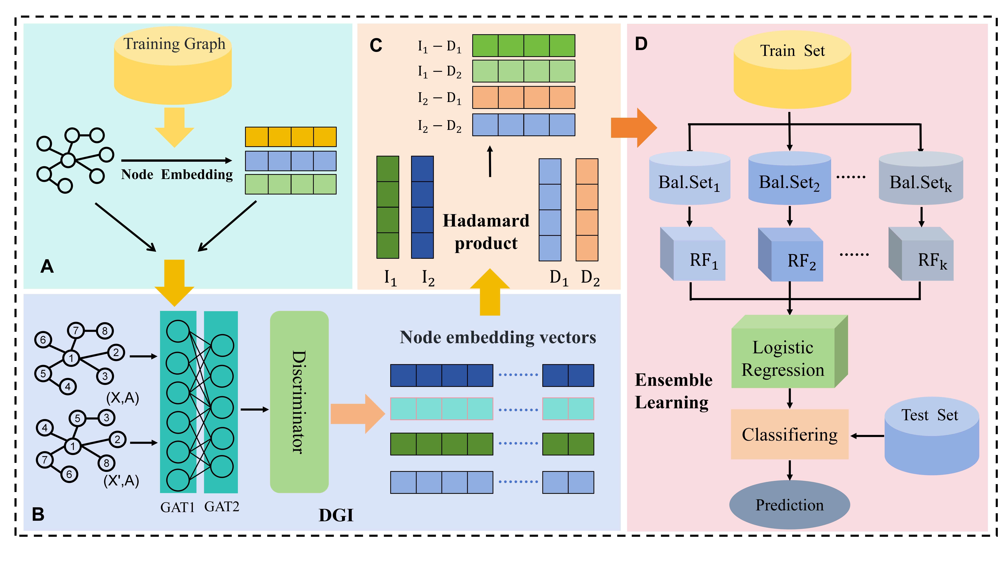

#########
Node2Vec-DGI-EL: A Hierarchical Graph Representation Learning Model for Ingredient-Disease Association Prediction

###Introduction :
We constructed a "Herb-Ingredient-Target-Disease" association network HITD based on the ETCM and STRING databases, which includes four types of entities and seven types of interaction relationships. Based on this dataset, we designed and built a Node2Vec-DGI-EL model for predicting the potential associations between Ingredient and diseases.

###The HITD :
|        Type           | Number of nodes | Number of nodes | Number of edges | Data Source |
|-----------------------|-----------------|-----------------|-----------------|-------------|
| Herb-Ingredient       | 402             | 6971            | 10304           | ETCM        |
| Herb-Target           | 399             | 1752            | 50061           | ETCM        |
| Herb-Disease          | 395             | 2704            | 248845          | ETCM        |
| Ingredient-Target     | 4185            | 1635            | 75112           | ETCM        |
| Ingredient-Disease    | 4029            | 2661            | 617530          | ETCM        |
| Disease-Target        | 4289            | 4887            | 73540           | ETCM        |
| PPI                   | 16201           | 16201           | 236930          | STRING      |

###model :

###requirements :
    python == 3.9.20
    torch ==  1.8.1+cu111
    dgl-cu111 == 0.6.1
    networkx == 3.2.1
    node2vec == 0.5.0
    numpy  == 1.26.4
    pandas == 1.3.5

###Train the model :

    run code:
        main.py

    if you need to use the model:
        please configure the following parameters in main.py:

        Need_to_use_test = True
        DGI_emb_save     = True
        EL_model_save    = True

        These are for saving relevant files, and explanations about these files can be found in the ../result/result.txt file.

###Use the model:

    run code:
        test.py

        Please enter the name of the ingredient or disease you want to predict.

###Files :
    The following content presents the files saved in the ../result directory after model training, along with a brief introduction to their contents.

    node_info.pkl:
    This file records the correspondence between the real node IDs and their index numbers.

    nodes_type_Ingredient.pkl:
    Records the index identifiers of Ingredient-type nodes in the HITD network.

    nodes_type_Disease.pkl:
    Records the index identifiers of Disease-type nodes in the HITD network.

    edge_info_with_names.csv :
        The file records the true association relationships between components and diseases in the HITD network, where 1 indicates an existing association and 0 indicates no association, to be compared with the model's prediction results.

    DGI_emb.npy:
    Stores node embedding vectors generated by the model.

    ensemble_models.joblib :
        The joblib file is the trained model file, which can be used to load the trained model and perform Ingredient-Disease association prediction.

###Contact :
    We welcome you to contact us (email: 2363955218@qq.com) for any questions and cooperations.